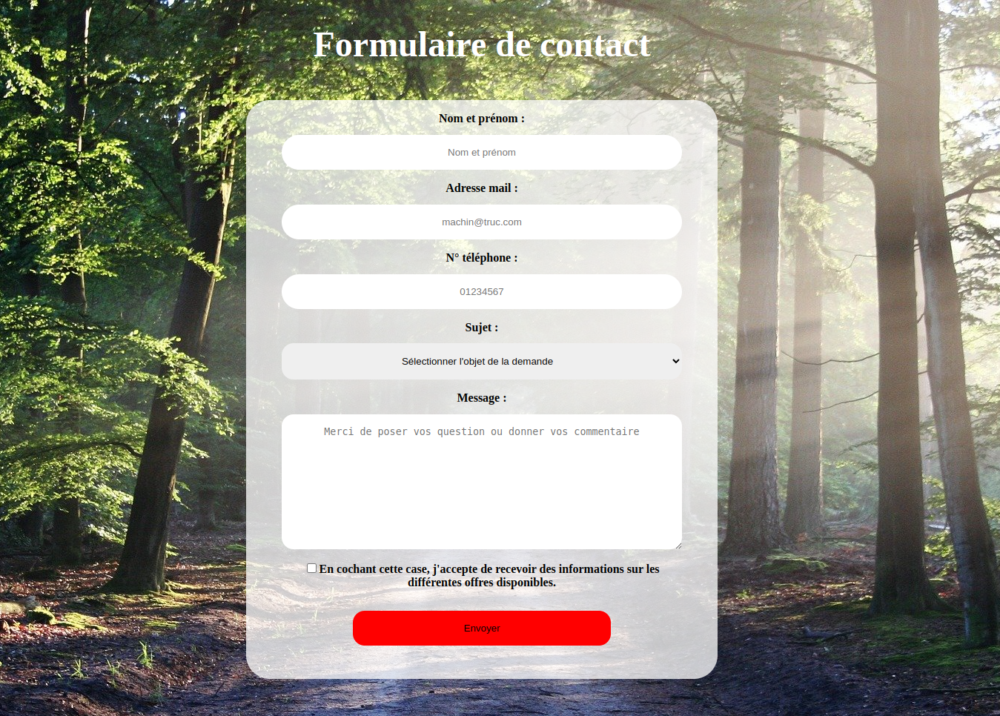

# Revisions on the forms

## Choose your form :

+ Contact form on a static html page
https://github.com/Tadkozh/Great-Form (other repository)
+ Form on React without a library to retrieve form field states
https://github.com/Tadkozh/Great-Form-React
+ Contact form with React-hook-form and Yup
https://github.com/Tadkozh/Great-Form-React/tree/Reacthookform-Yup

---
# TO SEE THIS PROJECT IN ACTION LOCALLY :
+ git clone git@github.com:Tadkozh/Great-Form-React.git
+ npm install
+ npm start
+ enjoy !

---
See the original README of Create React App : [ReadMeReact.md](./ReadMeReact.md)
